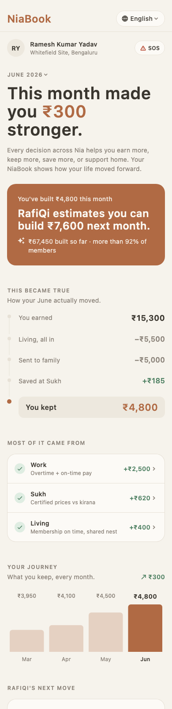
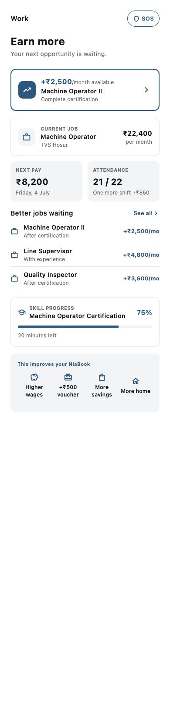
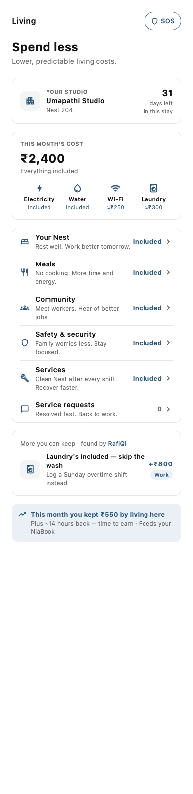
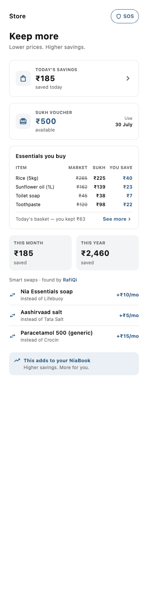
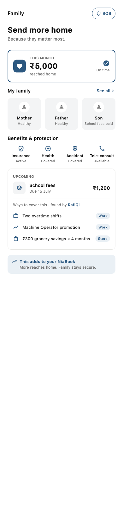

# Nia — Design System Lock

**Read this before writing any code.** This is the single source of truth for the
Member app's product and design. The approved screens below are the specification.
Do not redesign, reinterpret, improve, or simplify. If prose and screenshots
disagree, the screenshots win. Product decisions are locked; engineering quality may
always improve.

Product philosophy and laws live in [`PRODUCT_ARCHITECTURE.md`](PRODUCT_ARCHITECTURE.md).
This document locks the *implementation surface*.

---

## The approved screens

The five screens of the operating system. Real app renders (regenerate with
`cd apps/member && flutter test test/niabook_golden_test.dart --update-goldens`).

**NiaBook — the home ledger** (first tab, default)

> **NiaBook home redesigned 2026-07-05 (Founder-handed v0 prototype).** The home is
> now a **single-column emotional arc** — identity → hero (*"This month made you ₹X
> stronger"* + the built-this-month / RafiQi-estimates-next-month forecast) → **the
> story** waterfall (earned → living → family → saved → kept) → **attribution** back
> to the pillars → **momentum** (kept, month over month) → **RafiQi's next move** (one
> recommendation) → **since joining** → **who you're becoming**. This SUPERSEDES the
> earlier two-column *What became true / More you can keep* model for the home. The
> screenshot above is the new spec. Visual language for the home is the prototype's
> **warm cream / terracotta** palette (`NiaTokens.home*`) with **serif headlines** and
> a **red SOS** — a deliberate, Founder-approved departure from the blue/system-font/
> blue-SOS lock below, which still governs the four pillars until they are migrated.
> **Font caveat:** the serif face is Fraunces; offline it cannot be bundled, so
> headlines fall back to the system font until `Fraunces-*.ttf` is added to the app
> assets and `NiaTokens.serifFamily` is set (a one-step change — see the token).

**Work · Earn more** — 

**Living · Spend less** — 

**Store · Keep more** — 

**Family · Take better care of home** — 

---

## Navigation

- Bottom nav, five anchors, in order: **NiaBook · Work · Living · Store · Family.**
- **NiaBook is first and the default screen.** Selection is restrained blue; the rest
  are quiet grey line icons.
- **Full-bleed: no shell app bar.** Each screen owns its header (title, language, SOS).
- Icons: NiaBook `menu_book`, Work `work`, Living `home`, Store `shopping_bag`, Family
  `favorite`.

## Structure

- NiaBook: the single-column emotional arc (redesigned 2026-07-05 — see the screen
  note above). Proof still leads (the hero + the *This became true* waterfall); RafiQi
  still finds the one next move; attribution closes the loop back to the pillars.
- Pillars: built on `PillarScaffold` — Identity → Economic promise → Reality →
  Opportunity → Supporting → *Improves NiaBook* (always closes). A pillar must carry
  all three body roles (reality, opportunity, supporting); the scaffold asserts it.

## Tokens (`apps/member/lib/theme/nia_tokens.dart`)

- Colour: `blue #2C5880` (accent — headings, money, links, selection), `blueTint
  #EAF0F5` (hero/strip fill), `surfaceGrey #F3F4F5` (soft card fill), `ink #111111`,
  `inkSecondary #6B6B6B`, `hairline #E6E6E3`, `green #1E8E5A` (received/kept, NiaBook
  only). Colour carries state only — never decoration. No RAG.
- Space: 8-pt grid `s1..s8` (4·8·12·16·24·32·48·64). Radius 12.

## Components (`features/pillars/pillar_kit.dart`, `features/niabook/niabook_page.dart`)

- **Cards:** white + hairline (default) · soft grey (`grey`) · blue 2px border
  (`hero`, the primary opportunity). Radius 12.
- **Icon chip:** rounded grey square, thin blue icon; `filled` = solid blue + white
  icon (hero); `check` = blue check badge (became true); `muted` = grey (locked).
- **List row:** thin icon + title + subtitle, optional trailing gain + chevron.
- **Stat card:** caps label + value + sub, in pairs (wrap the pair in
  `IntrinsicHeight` for equal height).
- **Icon tile:** icon over label over status — the 4-across grids.
- **NiaBook strip:** blue-tint footer, `trending_up` + title + sub — the flywheel
  contribution that closes every pillar.
- **SOS:** quiet blue outline pill (`shield` + "SOS"), never red. Opens
  `openNiaEmergency` — abstract routing (today the Operator; do not couple the UI to
  it).
- **RafiQi line:** "<label> · found by RafiQi" (RafiQi in blue). Finder, not hero.
- **Pillar tag:** small blue-tint pill (e.g. "Work", "Store") for cross-pillar links.

## Typography

System font (San Francisco). Large title 22 · headline 24/700 · section 15–16/600 ·
body 14 · secondary 13 · caps 11/700 (0.5 tracking) · caption 12/11. Two–three
weights (400 / 600 / 700). Sentence case everywhere (caps labels excepted).

## Copy principles

Money first, explanation second. Human language, never banking. **No "wallet". No
"was leaving home worth it". No judgement.** Sentence case. Reserved glyphs: ₹ → · ○ ✓.

**Vocabulary (canonical):** Member (not tenant) · **Nest** (not room or bed) ·
Membership fee (not rent) · Studio (not PG/hostel) · NiaBook (not wallet). Place
hierarchy: **Nest → Coach → Studio → Theatre**.

## Layout law

**Optimise for scanning, not symmetry.** Understand any screen in under five seconds;
hierarchy beats visual balance. The models are frozen; the pixels flex for
readability (e.g. NiaBook columns are 45/55, not 50/50).

## The product laws (from PRODUCT_ARCHITECTURE.md)

1. Consistency is part of the product — no pillar invents its own structure.
2. The screens are the spec — screens beat words.
3. Money first; no judgement; no wallet language.
4. Every service must improve this month's NiaBook or make next month's better.
5. RafiQi finds; the Member decides. SOS routing stays abstract.
6. **The emotional contract — every screen leaves the Member more hopeful than when
   they opened it.** Not merely informed. A screen that only informs has failed, even
   if it matches the spec.

Intake test for any feature: (1) which of the four promises does it strengthen?
(2) how will NiaBook prove it? If it can't answer both, it doesn't belong.
**Everything improves NiaBook — this is sacred.**

---

## How to start every session

> Read `DESIGN_SYSTEM_LOCK.md` before writing any code.

Verify before you ship: `nia verify` (green + no codegen drift). Screens live in
`apps/member/lib/features/{niabook,pillars}`; the design language in
`theme/nia_tokens.dart` and `features/pillars/pillar_kit.dart`.
