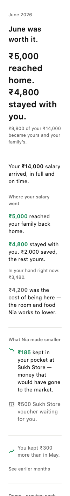
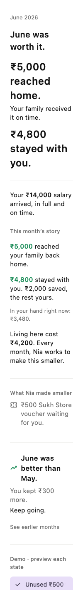
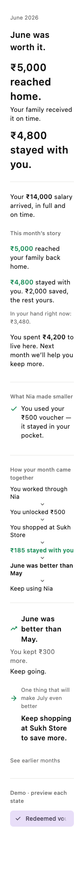
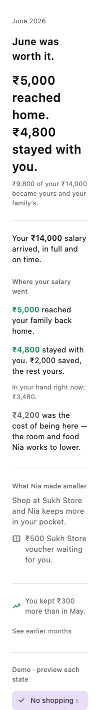
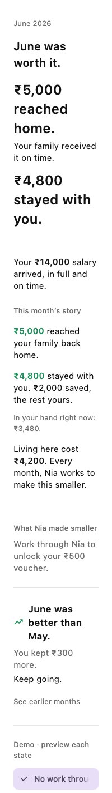

# NiaBook — board handover (open this first)

Prepared 2026-07-01 for the board meeting. One place, everything you need.

---

## Status at a glance

| | |
|---|---|
| Commit | `765da35` — "NiaBook copy pass: report-card, family first, verdict close" (on `c3ed8f3`, the wiring) |
| Branch | `pr/membership-product-review-build` |
| Recovery bundle | `nia-niabook-board-copy-20260701-105615.bundle` (verified) |
| Verification | `nia verify` **green** · 47 tests pass · `flutter analyze` clean · no codegen drift |
| See it live | `nia preview` (opens on NiaBook) |

---

## The one takeaway

If the board leaves with one thing: **Nia is no longer building features. It is
building a monthly record of progress for migrant workers.** A far more durable vision
than "we redesigned the wallet."

The product principle behind it: **every Nia service earns its place by making the next
page of NiaBook better** — the test for any feature is *"will this improve next month's
NiaBook?"* Living lowers the cost of being here; Sukh Store keeps more in your pocket;
Health prevents unexpected costs; Family ensures money reaches home; Learning raises
future earnings; Insurance protects what you've built. (Full direction:
`niabook-next-iteration.md`.)

---

## The narrative ladder — say it in this order

Lead with what the Member feels. Explain the mechanism only after they feel it.
Reach the business case last.

1. **Member truth** — *"More of what I earn reaches the people I care about, and
   stays with me."* More of my salary becomes mine.
2. **Product truth** — the mechanism is that **Nia reduces the cost of migration**.
   Every rupee Nia saves moves from "the cost of being here" into "money that stays
   with you."
3. **Business truth** — lower migration costs create **higher retention, greater
   lifetime value, stronger service attachment, and a defensible platform.**

The architecture shift to name: Nia is no longer an app with several tabs. It is a
product centred on a single artefact — **NiaBook** — with every other service
contributing evidence to it.

---

## The four key messages

1. **More of my salary becomes mine.** What reached home, what stayed with me — in my
   own language, no banking terms. (Member truth.)
2. **NiaBook is the centre of the app.** One artefact, opened every month, answering
   one question: *was leaving home worthwhile this month?*
3. **The mechanism: Nia reduces the cost of migration.** We do not raise anyone's
   salary; we lower what it costs to be away, and NiaBook makes that visible.
4. **Every service feeds NiaBook.** Work, Living, Sukh Store, Family, Health — each
   leaves visible evidence here. If a service cannot show up in NiaBook, we question
   whether it belongs.

---

## The one-minute demo flow

1. **Open the app.** It lands on NiaBook — the book icon, first tab. *(Message 2.)*
2. **The verdict.** "June was worth it." The answer before any number.
3. **The hero.** "₹5,000 reached home. Your family received it on time. ₹4,800 stayed
   with you." The family is named — the answer to "was it worth it?" is the people
   waiting, not a number. *(Member truth — message 1.)*
4. **This month's story.** Reached home, stayed with you, and the cost of being here —
   "Living here cost ₹4,200. Every month, Nia works to make this smaller."
5. **What Nia made smaller.** "You kept ₹185 that would have gone to market prices."
   Evidence, not a promotion. *(The mechanism — message 3.)*
6. **The five states** (tap the chips at the foot of the page). The verdict and the
   earned-money story hold through all of them; only Nia's added value changes. This
   is the flywheel: work through Nia → voucher → shop at Sukh Store → save → see it
   here → want more Nia.
7. **The closing verdict.** The page ends like a report-card, not a stop: "June was
   better than May. You kept ₹300 more. Keep going." A book of months; it fills as the
   Member stays. *(Message 4, then the business truth.)*

---

## The screens

Real app renders (system font, real icons), phone-sized. The board **opens on
capture 1** (the default June page — which is the Sukh Store savings state); captures
2–5 are the four further states. Files: `apps/member/test/goldens/`, mirrored to
`~/Desktop/niabook-states/`. Regenerate with
`flutter test test/niabook_golden_test.dart --update-goldens`.

**1 · Default June page — Sukh Store savings + voucher waiting**

**2 · Unused ₹500 voucher (waiting, grey — desire)**

**3 · Redeemed voucher — it stayed in your pocket**

**4 · No shopping savings yet — the invitation**

**5 · No work through Nia — the pull (verdict still holds)**

---

## If asked "is this live?"

Yes — the real app, opening on the real screen. The numbers are the Founder-accepted
June scenario held in the app (the money-movement backend is paused in the Product
Polish Phase), so the demo runs offline and cannot break in the room.
